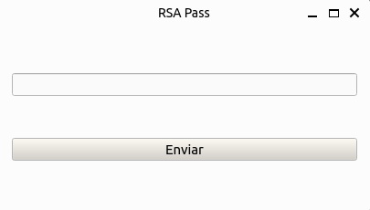

# Password Manager with PyQt6

## Description
This is a simple password manager project implemented in Python using PyQt6.

## Prerequisites
Make sure you have the following requirements installed before running the code:

- [Python 3.x](https://www.python.org/downloads/)
- [PyQt6](https://pypi.org/project/PyQt6/)

## Login Screen
The first screen that appears is the login screen, where the user must enter the correct password to sign in to the app. The input password is hashed and compared with the stored hash to verify if the user is authorized.  

We use the [SHA-256](https://en.wikipedia.org/wiki/SHA-2) encryption algorithm and Python's built-in [hashlib](https://docs.python.org/3/library/hashlib.html) library for hashing.

    

